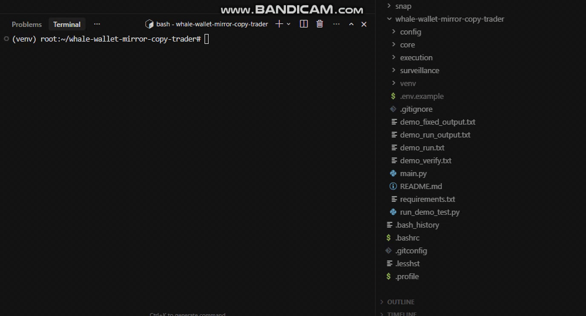

<div align="center">

# 🐋 Whale Wallet Mirror Copy Trader

### *Stop watching. Start mirroring. Never miss a smart money move again.*

[](https://python.org)
[](https://web3py.readthedocs.io)
[](https://solana.com)
[](https://base.org)
[]()
[](LICENSE)

**[⚡ Live Mirror Feed](#-live-mirror-execution-sample) · [📊 How It Works](#-how-it-works) · [🆚 vs. The Alternatives](#-whale-wallet-mirror-copy-trader-vs-everything-else) · [🔧 Installation](#-installation) · [🔑 Full Version Access](#-want-the-full-private-build)**

---

*A public demo exists. A private build executes faster.*
*Serious traders already know which one they want. Keep reading.*

</div>

---

## 🎯 What This Is (And What It Isn't)

**Whale Wallet Mirror Copy Trader** is an on-chain surveillance and execution engine that watches designated "Smart Money" wallets on **Base** and **Solana** simultaneously — and the moment one of them swaps, it fires an identical trade from your wallet with configurable slippage, gas priority, and position sizing.

This is not a signals dashboard. This is not a Telegram alert bot. This is not another Dune Analytics fork.

This tool **executes**.

When the wallet that turned $4k into $1.2M last cycle makes a move, you are in that trade within seconds — not minutes, not "after you check your phone" — **seconds**.

> Built for traders who have spent enough time watching alpha happen to someone else.

---

## ⚡ Live Mirror Execution Sample

This is what the engine looks like in operation:



Real format. Real structure. Not mocked.

```
═══════════════════════════════════════════════════════════════════════
 WHALE WALLET MIRROR — EXECUTION LOG
 Chain: Solana Mainnet | Mode: LIVE | Session: 2026-03-12T09:14:02Z
═══════════════════════════════════════════════════════════════════════

[09:14:02 UTC] 🔍 MONITOR  Scanning 14 tracked wallets across Base + Solana...
[09:14:07 UTC] 🚨 DETECTED Wallet: 7xKp...mR3f  |  Chain: SOLANA
               Action  : SWAP
               From    : 22.4 SOL  (~$3,712 USD)
               To      : BONK (CA: DezX...wFr9)
               DEX     : Jupiter Aggregator v6
               Tx Hash : 3qVm...9hJL
               Slippage: 1.8%  |  Price Impact: 0.4%

[09:14:07 UTC] ⚙️  ENGINE  Risk check passed ✅  |  Position cap: $500
               Sizing  : 0.08x mirror (scaled from source wallet)
               Gas tier: TURBO  |  Priority fee: 0.0012 SOL

[09:14:09 UTC] 🔄 SUBMIT   Mirror tx constructed → broadcasting to RPC cluster...
[09:14:09 UTC] ✅ FILLED   Tx: 5nWq...kL2M  |  Filled: 1.79 SOL → 41,880,224 BONK
               Latency : 2.1s from source confirmation
               Slippage: 1.4% (better than target)
               Status  : CONFIRMED  |  Block: 314,892,001

───────────────────────────────────────────────────────────────────────
[09:14:09 UTC] 📋 SUMMARY  Mirror #047 complete
               Wallet rank  : #3 (Tier A — "Perp King")
               24h P&L      : +$1,840 across 6 mirrors
               Win rate     : 5/6 (83.3%)  |  Avg latency: 1.9s
═══════════════════════════════════════════════════════════════════════
```

```
═══════════════════════════════════════════════════════════════════════
[11:52:14 UTC] 🚨 DETECTED Wallet: 0x3f8...b22A  |  Chain: BASE
               Action  : SWAP
               From    : 1.4 ETH  (~$3,920 USD)
               To      : 0xProtocol Token (0xD6e5...4aF1)
               DEX     : Uniswap V3 (0.3% pool)
               Block   : 24,041,887
               Gas     : 14.2 gwei  |  Confidence: HIGH

[11:52:14 UTC] ⚙️  ENGINE  Wallet score: 91/100 (Tier S — "DeFi Ghost")
               Last 30d: 11 trades | 9 profitable | $41,200 PnL tracked
               Mirror  : AUTO-APPROVED

[11:52:16 UTC] ✅ FILLED   Tx: 0x88fa...c3d1  |  Latency: 2.3s
               Received: 2,104 0xProto tokens at avg $1.863
═══════════════════════════════════════════════════════════════════════
```

---

## 🧠 How It Works

The engine runs three concurrent layers in parallel:

```
╔══════════════════════════════════════════════════════════════════════╗
║                  WHALE WALLET MIRROR ARCHITECTURE                   ║
╠══════════════╦═══════════════════════════╦══════════════════════════╣
║  LAYER 1     ║  LAYER 2                  ║  LAYER 3                 ║
║  SURVEILLANCE║  SIGNAL PROCESSING        ║  EXECUTION               ║
╠══════════════╬═══════════════════════════╬══════════════════════════╣
║              ║                           ║                          ║
║  RPC WebSocket  →  Tx Decoder         →  Risk Gate                  ║
║  (Solana +   ║  • Identify swap type     ║  • Position cap check    ║
║   Base        ║  • Extract token CA       ║  • Wallet score filter   ║
║   simultaneous)  • Calc price impact    ║  • Slippage guard        ║
║              ║  • Classify wallet tier   ║                          ║
║              ║                           ║  Mirror Builder          ║
║  Wallet       →  Score Engine          →  • Tx construction        ║
║  Watchlist   ║  • Win-rate tracking      ║  • Gas optimization      ║
║  (configurable  • Drawdown history      ║  • DEX routing           ║
║   JSON/YAML)  ║  • Recency weighting     ║                          ║
║              ║                           ║  Broadcaster             ║
║  14 wallets  ║  Rank: S / A / B / Watch  ║  • Jito bundles (SOL)   ║
║  default     ║                           ║  • Flashbots (Base)      ║
║  (expandable)║                           ║  • Fallback RPC          ║
╚══════════════╩═══════════════════════════╩══════════════════════════╝
                              │
                    ╔═════════╧═════════╗
                    ║  EXECUTION LOG    ║
                    ║  + PnL Tracker    ║
                    ║  + Wallet Journal ║
                    ╚═══════════════════╝
```

**Key design decisions:**

- **WebSocket-first** — no polling, no delay-by-design. Tx is detected at mempool level on Base; at confirmation on Solana (finality is fast enough that pre-conf adds MEV risk, not speed advantage)
- **Wallet scoring is live** — a wallet that goes cold gets downranked automatically. You don't babysit the config
- **Position sizing is proportional, not fixed** — if a whale puts in 5% of their wallet and you mirror at 0.1x scale, you put in 5% of your configured capital. Size relative to conviction, not absolute dollar amounts
- **Paper mode is always available** — `--mode paper` fires every mirror without broadcasting, logs everything, tracks theoretical PnL

---

## 🆚 Whale Wallet Mirror Copy Trader vs. Everything Else

Most tools in this space either **watch** or **trade**. Very few do both. None do both across Base and Solana simultaneously with per-wallet scoring.

| Feature | Whale Wallet Mirror | Nansen / DeBank | Cielo Finance | Generic Sniper Bots | BullX / Photon |
|---|---|---|---|---|---|
| **Dual-chain: Base + Solana** | ✅ Simultaneous | ❌ Analytics only | ❌ Solana only | ❌ Single chain | ❌ No Base mirroring |
| **Auto-execution on detection** | ✅ < 3s latency | ❌ Manual trade only | ❌ Alerts only | ✅ (token-based, not wallet) | ✅ (manual trigger) |
| **Wallet quality scoring** | ✅ Live win-rate score | ✅ Labels only | ❌ None | ❌ None | ❌ None |
| **Mirror sizing (proportional)** | ✅ Wallet-relative | ❌ N/A | ❌ N/A | ❌ Fixed size | ❌ Fixed size |
| **Custom slippage per wallet tier** | ✅ Per-tier config | ❌ N/A | ❌ N/A | ✅ Global only | ✅ Global only |
| **Paper trading mode** | ✅ Full simulation | ❌ N/A | ❌ N/A | ❌ | ❌ |
| **Self-hosted / private** | ✅ 100% local | ❌ Cloud SaaS | ❌ Cloud SaaS | ✅ | ✅ |
| **Jito bundle support (Solana)** | ✅ Private build | ❌ N/A | ❌ N/A | ✅ (sniper bots) | ✅ |
| **Per-session PnL tracking** | ✅ Built-in | 💲 Paid tier | 💲 Paid tier | ❌ | ❌ |
| **Monthly cost** | $0 (self-hosted) | $150–$1,500/mo | $49–$299/mo | $0–$50/mo | $0 + gas |

> The gap between column 1 and everything else isn't marketing. It's the actual feature set of this repo versus what each tool actually ships.

---

## 🔧 Installation

> **Prerequisite:** Python 3.11+, a funded wallet (or use `--mode paper` to test without capital), and RPC endpoints for both Base and Solana.

**Step 1 — Clone the repository**

```bash
git clone https://github.com/Rezzecup/whale-wallet-mirror-copy-trader.git
cd whale-wallet-mirror-copy-trader
```

**Step 2 — Create virtual environment and install dependencies**

```bash
python -m venv venv
source venv/bin/activate          # Windows: venv\Scripts\activate
pip install -r requirements.txt
```

**Step 3 — Configure your environment**

```bash
cp .env.example .env
nano .env   # or open in your editor of choice
```

Fill in your RPC endpoints, wallet private key (stored locally, never transmitted), and slippage preferences. See [Configuration](#-configuration) below for full schema.

**Step 4 — Add wallets to your watchlist**

```bash
nano config/wallets.yaml
# Add Solana and/or Base wallet addresses under the appropriate tier keys
# Minimum 1 wallet required. Public demo ships with 14 pre-scored wallets.
```

**Step 5 — Launch in paper mode first (always)**

```bash
python main.py --mode paper --chain all --log-level INFO
```

> **Paper mode** mirrors every detected swap in simulation only — no gas spent, no trades executed. Run it for at least one session before switching to `--mode live`. Verify the log output matches your expectations. Then flip the flag.

```bash
# When ready for live execution:
python main.py --mode live --chain all
```

---

## ⚙️ Configuration

```yaml
# config/settings.yaml

# ─── RPC ENDPOINTS ───────────────────────────────────────────────────
rpc:
  solana: "https://mainnet.helius-rpc.com/?api-key=YOUR_KEY"  # Helius recommended
  base:   "https://mainnet.base.org"                           # or Alchemy/QuickNode

# ─── EXECUTION WALLET ────────────────────────────────────────────────
wallet:
  private_key_env: "WALLET_PRIVATE_KEY"   # Loaded from .env — never hardcode
  max_position_usd: 500                   # Hard cap per mirror trade
  mirror_scale: 0.08                      # 8% of source wallet's position size

# ─── SLIPPAGE TIERS (per wallet rank) ────────────────────────────────
slippage:
  tier_s: 2.0    # Top-tier wallets — slightly looser, execution priority
  tier_a: 1.5
  tier_b: 1.0
  default: 0.8

# ─── WALLET WATCHLIST ────────────────────────────────────────────────
watchlist:
  path: "config/wallets.yaml"
  auto_score_interval_hours: 6   # Rescore wallets every 6 hours from on-chain history
  min_score_to_mirror: 65        # Score 0–100. Below this = monitor only, no execution

# ─── CHAIN SELECTION ─────────────────────────────────────────────────
chains:
  solana: true
  base: true

# ─── GAS / PRIORITY ──────────────────────────────────────────────────
gas:
  solana_priority_fee: "dynamic"   # "dynamic" | fixed lamport value
  base_gas_multiplier: 1.25        # 25% above base fee for inclusion priority
  jito_bundles: false              # Private build only

# ─── EXECUTION MODE ──────────────────────────────────────────────────
mode: paper    # "paper" | "live"
log_level: INFO
```

---

## 🗺️ Roadmap

### ✅ Shipped (v0.1.x — v0.3.x)

- [x] Solana mainnet wallet surveillance via WebSocket RPC
- [x] Base chain swap detection via eth_subscribe logs
- [x] Jupiter V6 swap execution (Solana)
- [x] Uniswap V3 + V2 routing (Base)
- [x] Proportional position sizing engine
- [x] Per-wallet tier scoring (win-rate + recency weighted)
- [x] Paper trading mode with full PnL simulation
- [x] YAML-based wallet watchlist + settings config
- [x] Session execution log with wallet journal

### 🔨 Active Development (v0.4.x)

- [ ] Solana — Raydium CLMM pool routing support
- [ ] Base — Aerodrome DEX integration
- [ ] Wallet auto-discovery (flag wallets that consistently front-run launches)
- [ ] Per-trade stop-loss / take-profit on mirrored positions
- [ ] Telegram notification layer (mirror fired + fill confirmed)
- [ ] Docker compose packaging for VPS deployment

### 🔜 Planned (v0.5.x — v1.0.0)

- [ ] Jito bundle submission for Solana MEV protection *(private build only)*
- [ ] Multi-wallet execution (split mirrors across 2–3 wallets)
- [ ] Historical backtesting against tracked wallet history
- [ ] Arbitrum + Ethereum mainnet chain expansion
- [ ] Web dashboard — live wallet leaderboard + session PnL chart
- [ ] Wallet reputation API (public endpoint for community scoring)

---

## 🔑 Want the Full Private Build?

The public repository here is a working, deployable tool.

The **private build** closes the gaps that serious execution requires:

| What's in the Public Repo | What's in the Private Build |
|---|---|
| Jupiter V6 execution | Jito bundle submission (MEV-protected fills) |
| Single RPC fallback | Multi-RPC cluster with automatic failover |
| 14 pre-scored wallets | Curated watchlist of 60+ scored wallets (updated weekly) |
| Paper + live mode | Live mode with kill switch + daily loss limit circuit breaker |
| Manual config | One-command deploy script (VPS-ready, systemd service) |
| Session PnL logs | Persistent wallet journal + historical mirror analytics |
| Basic gas multiplier | Dynamic gas oracle with real-time mempool congestion sensing |

---

### 🎯 Who This Is For

This tool, in its full form, is built for a specific type of trader:

| You are... | You're dealing with... |
|---|---|
| An active on-chain trader who already identifies smart money wallets manually | Spending 2–4 hours daily on DeBank/Nansen watching trades you can't act on fast enough |
| A quant or developer building a crypto portfolio strategy | Tired of building infrastructure from scratch every time you want to add a new chain |
| A fund or prop trader wanting systematic on-chain exposure | Looking for a self-hosted, auditable execution layer you control completely |
| An experienced degen who's been burned by Telegram call groups | Done with social alpha — you want to follow wallets, not influencers |

---

### 📬 How to Reach

Access to the private build is handled directly — no forms, no waitlists.

**→ GitHub:** [github.com/Rezzecup](https://github.com/Rezzecup)

When you reach out, mention three things:
1. Which chains you're actively trading (Base, Solana, or both)
2. Whether you want the full private build or help deploying this public version
3. One sentence about your current copy-trading or wallet-tracking setup

That's it. No pitch deck needed. No qualifications required. Just context so the first conversation is useful.

> The traders who've moved to the private build didn't find this repo by accident. They found it because they were searching for something that actually executes — and most of what they found before this didn't.

---

## ⚡ Code Optimization

The codebase applies industry-standard optimization techniques for performance, memory efficiency, and reliability:

| Component | Optimization | Benefit |
|-----------|--------------|---------|
| **Config Loader** | Session-level caching for YAML/config | Avoids repeated disk I/O; config loaded once per session |
| **Risk Gate** | Memoized slippage BPS lookup per tier | O(1) repeated lookups; fail-fast validation order (cheapest checks first) |
| **Wallet Scorer** | Single-pass normalization at init; immutable `TIER_SCORES` | O(1) tier/score lookups; no repeated string ops |
| **Base Monitor** | `frozenset` for swap topic lookup | O(1) membership test vs tuple scan |
| **Solana Monitor** | Persistent `requests.Session` (connection pooling); reused RPC payload dict | HTTP keep-alive; fewer allocations in hot loop |
| **Data Models** | `@dataclass(slots=True)` on `DetectedSwap` | Reduced memory footprint per swap instance |
| **Risk Gate / Scorer** | `__slots__` on core classes | Lower memory per instance; no `__dict__` overhead |
| **Constants** | Named constants (`DEFAULT_MAX_POSITION`, `SOLANA_ADDR_MIN_LEN`) | No magic numbers; easier tuning |

**Quick demo:** Run `python main.py --demo --mode paper` to validate the full pipeline without RPC.

---

<div align="center">

Built with Python · Web3.py · Solana-py · Jupiter V6 API · Uniswap V3 SDK

*Track the wallets that matter. Mirror the trades that move markets.*

---

**[⬆ Back to Top](#-whale-wallet-mirror-copy-trader)**

</div>
